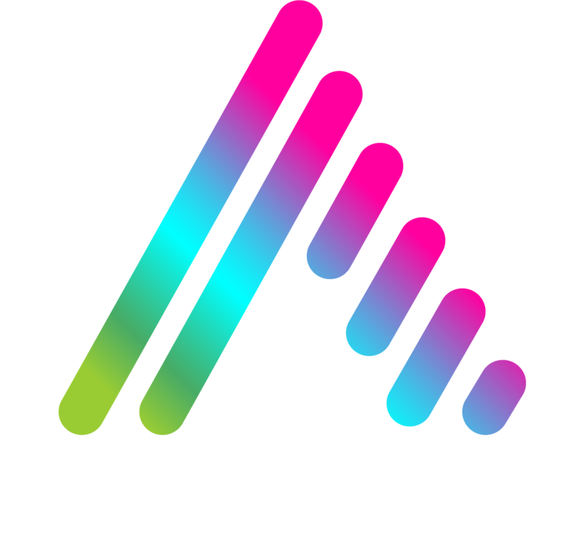
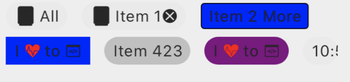

# Aurora Controls for .NET MAUI

<p align="center" style="border-radius: 10px;">
  
</p>

A collection of beautiful, customizable UI controls for .NET MAUI applications. Aurora Controls provides a rich set of controls designed with modern UI/UX principles in mind.


## Features

- 🎨 Modern, customizable UI controls
- 📱 Cross-platform compatibility (iOS, Android)
- ⚡ High-performance rendering with SkiaSharp
- 🎯 Touch and gesture support
- 🔄 Two-way binding support
- 🎭 Rich animation capabilities
- 📦 Easy integration with existing MAUI projects

## Installation

Install via NuGet:

```bash
dotnet add package AuroraControls.Maui
```

## Setup

1. In your `MauiProgram.cs`, add Aurora Controls:

```csharp
public static MauiApp CreateMauiApp()
{
    var builder = MauiApp.CreateBuilder();
    builder
        .UseMauiApp<App>()
        .UseAuroraControls<App>();

    return builder.Build();
}
```

2. Add the namespace to your XAML:

```xml
xmlns:aurora="http://auroracontrols.maui/controls"
```

## Controls

### Interactive Components

### Tile

An advanced button-like control with support for SVG images, text, ripple effects, shadows, and notification badges.

```xml
<aurora:Tile
    Text="Settings"
    EmbeddedImageName="Assets/settings.svg"
    MaxImageSize="24,24"
    ButtonBackgroundColor="#4A90E2"
    FontColor="White"
    FontSize="16"
    BorderColor="White"
    BorderWidth="1"
    CornerRadius="8"
    ShadowColor="#80000000"
    ShadowBlurRadius="4"
    ShadowLocation="0,3"
    Ripples="true"
    ContentPadding="12"
    Command="{Binding SettingsCommand}">
    <aurora:Tile.NotificationBadge>
        <aurora:NotificationBadge NotificationCount="5" />
    </aurora:Tile.NotificationBadge>
</aurora:Tile>
```

Features:
- SVG image support with size constraints and optional color overlay
- Rich text customization (color, size, font, iconified text support)
- Material Design ripple effects on touch
- Customizable shadows with blur and offset
- Border and corner radius styling
- Optional notification badge integration
- Smooth tap animations
- Command binding and click event support
- Content padding configuration

### SvgImageButton

A customizable button control that displays SVG images with various background shapes, animations, and styling options.

```xml
<aurora:SvgImageButton
    EmbeddedImageName="icon.svg"
    BackgroundShape="Circular"
    BackgroundColor="#4A90E2"
    OverlayColor="White"
    ImageInset="8"
    MaxImageSize="32,32"
    Animated="True"
    AnimationScaleAmount="0.1"
    CornerRadius="12"
    Command="{Binding ButtonCommand}"
    CommandParameter="IconButton"
    HeightRequest="64"
    WidthRequest="64" />
```

Features:
- Display embedded SVG images with automatic scaling and centering
- Choose from None, Square, Circular, or RoundedSquare backgrounds
- Separate control over background color and SVG overlay color
- Control spacing around the SVG icon within the button
- Set maximum image size to prevent over-scaling
- Smooth scale-down animation on touch with customizable easing
- Full support for MVVM-pattern with Command and CommandParameter
- Corner radius support
- Click event handling for code-behind scenarios

#### Background Shape Options:
- `None` - No background, only the SVG icon
- `Square` - Rectangular background
- `Circular` - Circular/oval background
- `RoundedSquare` - Square with rounded corners (configurable via `CornerRadius`)

#### Animation Configuration:
- `Animated` - Enable/disable touch animations
- `AnimationScaleAmount` - How much to scale down on touch (0.0 to 1.0)
- `AnimationEasing` - Easing function for the animation (BounceOut, SpringOut, etc.)

### GradientPillButton

<p align="center" style="border-radius: 10px;">
  
  
  
</p>

A pill-shaped button with gradient background, shadow, and ripple effects.

```xml
<aurora:GradientPillButton
    Text="Click Me"
    ButtonBackgroundStartColor="#FF6B6B"
    ButtonBackgroundEndColor="#4ECDC4"
    FontColor="White"
    Command="{Binding MyCommand}"
    ShadowColor="#80000000"
    ShadowBlurRadius="4"
    ShadowLocation="0,3" />
```

### SegmentedControl

<p align="center" style="border-radius: 10px;">
  
</p>

A segmented control similar to iOS UISegmentedControl.

```xml
<aurora:SegmentedControl
    SelectedIndex="{Binding SelectedViewIndex}"
    ControlForegroundColor="{StaticResource Primary}"
    ControlBackgroundColor="White"
    BorderSize="1">
    <aurora:Segment Text="Day" />
    <aurora:Segment Text="Week" />
    <aurora:Segment Text="Month" />
</aurora:SegmentedControl>
```

### ToggleBox

<p align="center" style="border-radius: 10px;">
  
</p>

A versatile toggle/checkbox control with multiple styles and customization options.

```xml
<aurora:ToggleBox
    IsToggled="{Binding IsSelected}"
    Shape="RoundedSquare"
    CheckType="Check"
    CheckColor="White"
    BorderColor="Blue"
    BorderWidth="2"
    MarkWidth="2"
    CornerRadius="4"
    BackgroundColor="Transparent"
    ToggledBackgroundColor="Blue"
    Value="{Binding Item}" />
```

Features:
- Multiple shapes: Square, Circular, RoundedSquare
- Different check mark styles: Cross, Check, RoundedCheck, Circular
- Customizable colors for border, background, and check mark
- Configurable border width, mark width, and corner radius
- Two-way binding support for toggle state
- Optional value binding
- Toggle state change events

### CupertinoToggleSwitch

<p align="center" style="border-radius: 10px;">
  
  
  
</p>

An iOS-style toggle switch with smooth animations.

```xml
<aurora:CupertinoToggleSwitch
    IsToggled="{Binding IsEnabled}"
    TrackEnabledColor="#4CD964"
    TrackDisabledColor="#E9E9EA"
    ThumbColor="White" />
```

### CupertinoTextToggleSwitch

An iOS-style toggle switch with text labels.

```xml
<aurora:CupertinoTextToggleSwitch
    IsToggled="{Binding IsDarkMode}"
    EnabledText="ON"
    DisabledText="OFF"
    TrackEnabledColor="#4CD964"
    EnabledFontColor="White"
    DisabledFontColor="#272727" />
```

### NumericEntry

<p align="center" style="border-radius: 10px;">
  
</p>

A customizable numeric entry control.

```xml
<aurora:NumericEntry
    Value="{Binding NumericValue}"
    Placeholder="Enter number"
    TextColor="Black"
    PlaceholderColor="Gray" />
```

### SignaturePad

<p align="center" style="border-radius: 10px;">
  
</p>

A control for capturing handwritten signatures.

```xml
<aurora:SignaturePad
    StrokeColor="Black"
    StrokeWidth="3"
    BackgroundColor="White" />
```
### ChipGroup and Chip

<p align="center" style="border-radius: 10px;">
  
</p>

A flexible chip component and chip group container for creating tag-like UI elements with selection capabilities.

```xml
<!-- Single-selection ChipGroup -->
<aurora:ChipGroup
    IsScrollable="False"
    AllowMultipleSelection="False"
    HorizontalSpacing="8"
    VerticalSpacing="8"
    SelectedValue="{Binding SelectedCategory}"
    SelectionChanged="OnChipSelectionChanged">
    
    <aurora:Chip Text="Apple" Value="apple" />
    <aurora:Chip Text="Banana" Value="banana" />
    <aurora:Chip Text="Cherry" Value="cherry" />
</aurora:ChipGroup>

<!-- Data-bound ChipGroup -->
<aurora:ChipGroup
    IsScrollable="True"
    AllowMultipleSelection="True"
    ItemsSource="{Binding ChipItems}"
    ItemTemplate="{StaticResource ChipTemplate}"
    SelectedValues="{Binding SelectedValues}"
    SelectionChanged="OnSelectionChanged" />
```

#### ChipGroup Features:
- **Layout Options**:
    - `IsScrollable` - Toggle between scrollable single-line mode and multi-line wrapping mode
    - `HorizontalSpacing` and `VerticalSpacing` - Customize the spacing between chips

- **Selection Management**:
    - `AllowMultipleSelection` - Toggle between single and multiple selection modes
    - `SelectedChip` - Get/set the currently selected chip in single selection mode
    - `SelectedChips` - Collection of currently selected chips in multi-selection mode
    - `SelectedValue` - Get/set the value of the selected chip in single selection mode
    - `SelectedValues` - Collection of values from the selected chips in multi-selection mode
    - `SelectionChanged` event - Provides information about selection changes

- **Collection Integration**:
    - `ItemsSource` - Bind to a collection of data items
    - `ItemTemplate` - Define a template for creating chips from data items

- **Navigation Methods**:
    - `ScrollToChip(...)` - Scroll to a specific chip
    - `ScrollToChipWithValue(...)` - Find and scroll to a chip by its value
    - `ScrollToSelectedChip(...)` - Scroll to the currently selected chip
    - `SelectChipByValue(...)` - Programmatically select a chip by its value
    - `GetChipByValue(...)` - Find a chip by its value

#### Chip Features:
- `Text` - The text displayed on the chip
- `Value` - An associated value for the chip (used for binding and selection)
- `IsToggled` - The selection state of the chip
- `IsRemovable` - Whether the chip shows a removal button
- `BackgroundColor`/`ToggledBackgroundColor` - Customize appearance based on selection state
- `FontColor`/`ToggledFontColor` - Customize text color based on selection state
- `LeadingEmbeddedImageName` - Display an SVG image at the start of the chip
- `IsSingleSelection` - Auto-configured by ChipGroup based on AllowMultipleSelection

#### Example with Value Binding:
```xml
<!-- Chip group with two-way value binding -->
<aurora:ChipGroup
    AllowMultipleSelection="False"
    SelectedValue="{Binding SelectedCategory, Mode=TwoWay}">
    
    <aurora:Chip Text="Work" Value="work" />
    <aurora:Chip Text="Personal" Value="personal" />
    <aurora:Chip Text="Other" Value="other" />
</aurora:ChipGroup>
```

#### Example with Multi-Value Binding:
```xml
<!-- Multi-select chip group with values collection -->
<aurora:ChipGroup
    AllowMultipleSelection="True"
    ItemsSource="{Binding FilterOptions}">
    <!-- SelectedValues will contain the Value of each selected chip -->
</aurora:ChipGroup>
```

### Visual Elements

### SVGImageView

<p align="center" style="border-radius: 10px;">
  
</p>

A control for displaying SVG images.

```xml
<aurora:SVGImageView
    Source="image.svg"
    WidthRequest="200"
    HeightRequest="200" />
```

### NotificationBadge

<p align="center" style="border-radius: 10px;">
  
</p>

A badge control for displaying notifications.

```xml
<aurora:NotificationBadge
    BadgeText="99+"
    BadgeBackgroundColor="Red"
    BadgeTextColor="White" />
```

### Layout Controls

### CardViewLayout

<p align="center" style="border-radius: 10px;">
  
</p>

A material design inspired card container with elevation, rounded corners, and border customization.

```xml
<aurora:CardViewLayout
    CornerRadius="12"
    Elevation="4"
    BorderSize="1"
    BorderColor="Gray"
    BackgroundColor="White">
    <StackLayout Padding="16">
        <Label Text="Card Title" FontSize="20" />
        <Label Text="Card content goes here" />
    </StackLayout>
</aurora:CardViewLayout>
```

### GradientColorView

<p align="center" style="border-radius: 10px;">
  
</p>

A view that displays a customizable gradient background with support for touch interactions and animations.

```xml
<aurora:GradientColorView
    GradientStartColor="Blue"
    GradientStopColor="Purple"
    GradientRotationAngle="45"
    Ripples="True">
    <Label Text="Gradient Background" TextColor="White" />
</aurora:GradientColorView>
```

### Progress Indicators

### Linear Gauge

<p align="center" style="border-radius: 10px;">
  
</p>

A horizontal or vertical progress gauge.

```xml
<aurora:LinearGauge
    Progress="{Binding Progress}"
    ProgressColor="Blue"
    ProgressBackgroundColor="Gray"
    ProgressThickness="10"
    EndCapType="Rounded" />
```

### Circular Gauge

<p align="center" style="border-radius: 10px;">
  
</p>


A circular progress indicator.

```xml
<aurora:CircularGauge
    Progress="{Binding Progress}"
    ProgressColor="Blue"
    ProgressBackgroundColor="Gray"
    ProgressThickness="10"
    EndCapType="Rounded" />
```

### CircularFillGauge

<p align="center" style="border-radius: 10px;">
  
</p>

A circular gauge that fills with color based on progress.

```xml
<aurora:CircularFillGauge
    Progress="{Binding Progress}"
    ProgressColor="Blue"
    ProgressBackgroundColor="Gray" />
```
### Custom Controls

#### TouchDrawLettersImage

<p align="center" style="border-radius: 10px;">
  
</p>

A specialized view for drawing letter shapes, useful for handwriting recognition or educational apps.

```xml
<aurora:TouchDrawLettersImage
    StrokeColor="Black"
    StrokeWidth="3"
    BackgroundColor="White"
    LetterSpacing="20" />
```
#### ConfettiView

A high-performance confetti particle animation control optimized for smooth rendering with hundreds of particles. Perfect for celebrations, achievements, and adding festive effects to your application.

```xml
<aurora:ConfettiView
    MaxParticles="300"
    ConfettiShape="Rectangular"
    Continuous="False"
    ParticleSize="6.0"
    Gravity="0.08"
    WindIntensity="0.3"
    EmissionRate="5"
    FadeOut="True"
    BurstMode="False"
    BackgroundColor="Transparent">
    <aurora:ConfettiView.Colors>
        <x:Array Type="{x:Type Color}">
            <Color>#FF6B6B</Color>
            <Color>#4ECDC4</Color>
            <Color>#45B7D1</Color>
            <Color>#FFA07A</Color>
            <Color>#98D8C8</Color>
        </x:Array>
    </aurora:ConfettiView.Colors>
</aurora:ConfettiView>
```

Features:
- **High Performance**: Optimized for rendering up to 500+ particles with smooth 60fps animation
- **Customizable Particles**: Control size, shape (rectangular or circular), colors, and physics
- **Multiple Animation Modes**:
    - Standard falling confetti from top
    - Burst mode for explosion effects from center
    - Continuous mode for ongoing particle emission
- **Physics Simulation**: Realistic gravity, wind effects, and particle rotation
- **Color Themes**: Use custom color palettes or automatic random colors
- **Lifecycle Management**: Optional fade-out effects and particle aging
- **Memory Optimized**: Pre-allocated particle arrays and lookup tables for performance

##### Key Properties:
- `MaxParticles` - Maximum number of particles (default: 300, max: 500+)
- `ConfettiShape` - Particle shape: Rectangular or Circular
- `Continuous` - Enable continuous particle emission
- `ParticleSize` - Base size of particles (randomized between 50%-100% of value)
- `Gravity` - How fast particles fall (higher = faster falling)
- `WindIntensity` - Horizontal drift strength
- `EmissionRate` - New particles per frame in continuous mode
- `FadeOut` - Enable particle fade-out over time
- `BurstMode` - Explosion effect from center instead of falling from top
- `Colors` - Custom color palette (uses random colors if not specified)

##### Usage Examples:

**Celebration Burst:**
```xml
<aurora:ConfettiView
    MaxParticles="400"
    BurstMode="True"
    FadeOut="True"
    ConfettiShape="Rectangular"
    ParticleSize="8" />
```

**Continuous Falling Confetti:**
```xml
<aurora:ConfettiView
    Continuous="True"
    EmissionRate="8"
    MaxParticles="200"
    Gravity="0.12"
    WindIntensity="0.5" />
```

**Custom Color Theme:**
```csharp
// In code-behind or view model
confettiView.Colors = new List<Color>
{
    Colors.Gold,
    Colors.Silver,
    Colors.White
};
```

##### Performance Tips:
- Keep MaxParticles under 300 for optimal performance on older devices
- Use BurstMode for short celebration effects, Continuous for ambient effects

### Loading Indicators

#### CupertinoActivityIndicator

[Sample Video](images/CupertinoActivityIndicator.m4v)

iOS-style spinning activity indicator.

#### MaterialCircular

[Sample Video](images/MaterialCircular.m4v)

Material Design circular progress indicator with smooth animations.

#### Nofriendo

[Sample Video](images/Nofriendo.m4v)

A custom loading animation inspired by retro gaming.

#### RainbowRing

[Sample Video](images/RainbowRing.m4v)

A colorful rainbow ring loading animation.

#### Waves

[Sample Video](images/Waves.m4v)

An animated wave-style loading indicator.

## Visual Effects System

Aurora Controls includes a powerful visual effects system that can be applied to any Aurora view control. The effects are powered by SkiaSharp for high-performance image processing.

### Available Effects

- **Color Effects**
  - `BlackAndWhite` - Converts image to black and white
  - `Brightness` - Adjusts image brightness
  - `Contrast` - Modifies image contrast
  - `Grayscale` - Converts image to grayscale
  - `HighContrast` - Applies high contrast effect
  - `Hue` - Adjusts image hue
  - `Invert` - Inverts image colors
  - `Saturation` - Adjusts color saturation
  - `Sepia` - Applies sepia tone effect

- **Transform Effects**
  - `Scale` - Scales the image
  - `Rotate` - Rotates the image
  - `Skew` - Applies skew transformation
  - `ThreeDee` - Applies 3D rotation effect
  - `Translate` - Moves the image

- **Special Effects**
  - `Gradient` - Applies gradient overlay
  - `Pixelate` - Creates pixelation effect
  - `Watermark` - Adds watermark to image
  - `HistogramEqualization` - Enhances image contrast using histogram equalization

### Using Visual Effects

Effects can be applied to any Aurora view that implements `IAuroraView`. You can add multiple effects and enable/disable them dynamically.

```xml
<aurora:AuroraView>
    <aurora:AuroraView.VisualEffects>
        <aurora:Sepia />
        <aurora:Brightness BrightnessAmount="0.2" />
        <aurora:Contrast ContrastAmount="1.2" />
    </aurora:AuroraView.VisualEffects>
</aurora:AuroraView>
```

### Adding Effects in Code

```csharp
var auroraView = new AuroraView();
auroraView.VisualEffects.Add(new Sepia());
auroraView.VisualEffects.Add(new Brightness { BrightnessAmount = 0.2 });
```

### Managing Effects

Effects can be enabled/disabled individually:

```csharp
var effect = auroraView.VisualEffects[0];
effect.Enabled = false; // Temporarily disable the effect
```

Effects are applied in order, so the sequence matters. You can reorder effects:

```csharp
auroraView.VisualEffects.Remove(effect);
auroraView.VisualEffects.Insert(0, effect); // Move to first position
```

### Creating Custom Effects

You can create custom visual effects by inheriting from `VisualEffect`:

```csharp
public class CustomEffect : VisualEffect
{
    public override SKImage ApplyEffect(SKImage image, SKSurface surface, SKImageInfo info, SKRect overrideRect)
    {
        // Implement your effect here using SkiaSharp
        using (var paint = new SKPaint())
        using (var surfaceImage = surface.Snapshot())
        {
            surface.Canvas.Clear();
            // Apply your custom effect
            surface.Canvas.DrawImage(surfaceImage, rect, paint);
        }
        return surface.Snapshot();
    }

    public override SKImage ApplyEffect(SKImage image, SKSurface surface, GRBackendRenderTarget info, SKRect overrideRect)
    {
        // Implement GPU-accelerated version if needed
        return ApplyEffect(image, surface, new SKImageInfo(), overrideRect);
    }
}
```

### Performance Considerations

- Effects are applied sequentially, so use only the effects you need
- Some effects (like ThreeDee and Pixelate) are more computationally intensive
- Consider using GPU acceleration when available by implementing the GRBackendRenderTarget version of ApplyEffect
- Effects are processed on a background thread to maintain UI responsiveness

## Contributing

Contributions are welcome! Please feel free to submit a Pull Request.

## License

[MIT License](LICENSE)

## Support

If you encounter any issues or have questions, please file an issue on the GitHub repository.
